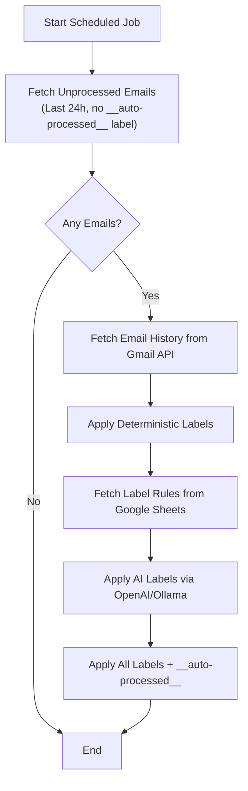

# Email Auto-Labeling Application

## Architecture Overview

The application will be a stateless service that:

1. Periodically fetches recent emails from Gmail API
2. Applies deterministic labels based on 4 rules (querying Gmail API for history)
3. Applies AI-based labels from Google Sheets prompts
4. Applies labels back to emails via Gmail API

## Implementation Plan

### 1. Project Setup

- Initialize Bun TypeScript project with `package.json`
- Configure TypeScript (`tsconfig.json`)
- Set up project structure:
  - `src/index.ts` - Main entry point with scheduler
  - `src/gmail.ts` - Gmail API client and email operations
  - `src/deterministic.ts` - Deterministic labeling rules
  - `src/ai-labeler.ts` - AI-based labeling with OpenAI/Ollama
  - `src/sheets.ts` - Google Sheets fetching
  - `src/types.ts` - TypeScript type definitions
  - `src/config.ts` - Environment configuration

### 2. Gmail API Integration (`src/gmail.ts`)

- Use `googleapis` package for Gmail API
- OAuth2 authentication (service account or OAuth tokens)
- Use a system label `__auto-processed__` to track processed emails (not visible in most clients)
- Functions:
  - `fetchUnprocessedRecentEmails()` - Get emails from last 24 hours that don't have `__auto-processed__` label
  - `fetchAllSentEmails()` - Get all sent emails for history (stateless)
  - `fetchAllReceivedEmails()` - Get all received emails for history (stateless)
  - `applyLabel(emailId, labelName)` - Apply label to email
  - `applyLabels(emailId, labelNames[])` - Apply multiple labels at once
  - `createLabelIfNotExists(labelName)` - Ensure label exists (create `__auto-processed__` on startup)
  - `markAsProcessed(emailId)` - Apply `__auto-processed__` label after processing

### 3. Deterministic Labeling (`src/deterministic.ts`)

- Stateless implementation - queries Gmail API on each run
- Four rules:

  1. `first-domain` - Check if sender domain exists in all received emails
  2. `first-address` - Check if sender address exists in all received emails
  3. `no-email-domain` - Check if recipient domain exists in all sent emails
  4. `no-email-address` - Check if recipient address exists in all sent emails

- Build sets from Gmail API queries, then check each email against sets

### 4. Google Sheets Integration (`src/sheets.ts`)

- Fetch public sheet using CSV export URL: `https://docs.google.com/spreadsheets/d/1T9vwarXB3ICksZpP4gHw-rllKve0j2tKBDEEEsIVEAM/export?format=csv`
- Parse CSV to extract label (col 1) and prompt (col 2) pairs
- Cache results with TTL to avoid excessive API calls

### 5. AI Labeling (`src/ai-labeler.ts`)

- Support both OpenAI API and Ollama
- For each email, check content against prompts from Google Sheets
- Simple string matching initially (can be enhanced with regex/NLP)
- Optional: Use AI model to determine if email matches prompt pattern
- Configuration via `AI_PROVIDER` env var (default: "openai")

### 6. Main Scheduler (`src/index.ts`)

- Run as scheduled job (configurable interval via env var)
- On startup: ensure `__auto-processed__` label exists
- Orchestrate: 

  1. Fetch unprocessed emails (last 24h, excluding `__auto-processed__` label)
  2. For each email: apply deterministic labels → AI labels
  3. Apply all labels + `__auto-processed__` label in one API call

- Error handling and logging
- Graceful shutdown
- If processing fails for an email, don't mark as processed (allows retry)

### 7. Dockerfile

- Base image: `oven/bun:latest` (official Bun image)
- Install Ollama in the same container:
  - Download and install Ollama binary
  - Pull a lightweight model (e.g., `llama3.2:1b` or `phi3:mini`)
  - Run Ollama as a background service
- Copy source and install dependencies
- Set working directory
- Use a startup script that:

  1. Starts Ollama in the background
  2. Waits for Ollama to be ready
  3. Runs the main application

- Expose port 11434 for Ollama (optional, for debugging)
- CMD: Use a startup script that runs both Ollama and the app

### 8. Deployment Configuration

- `deploy.yaml` with Fargate settings
- `package.json` with deploy script
- Add deploy as dev dependency

### 9. Environment Variables

- `GMAIL_CLIENT_ID` - OAuth client ID
- `GMAIL_CLIENT_SECRET` - OAuth client secret
- `GMAIL_REFRESH_TOKEN` - OAuth refresh token
- `OPENAI_API_KEY` - OpenAI API key (optional, only needed if using OpenAI)
- `OLLAMA_URL` - Ollama server URL (default: http://localhost:11434)
- `OLLAMA_MODEL` - Ollama model to use (default: "llama3.2:1b" or "phi3:mini")
- `AI_PROVIDER` - "openai" or "ollama" (default: "ollama" for local, "openai" for production)
- `POLL_INTERVAL_MINUTES` - How often to run (default: 5)
- `GOOGLE_SHEETS_ID` - Spreadsheet ID (from URL)
- `PROCESSED_LABEL` - Label name for tracking processed emails (default: "**auto-processed**")

## Files to Create

1. `package.json` - Dependencies and scripts
2. `tsconfig.json` - TypeScript configuration
3. `src/index.ts` - Main entry point
4. `src/gmail.ts` - Gmail API client
5. `src/deterministic.ts` - Deterministic labeling
6. `src/ai-labeler.ts` - AI labeling
7. `src/sheets.ts` - Google Sheets fetching
8. `src/types.ts` - Type definitions
9. `src/config.ts` - Configuration
10. `Dockerfile` - Production Docker image with Ollama bundled
11. `start.sh` - Startup script to run Ollama and app together
12. `deploy.yaml` - Deployment configuration
13. `.gitignore` - Git ignore rules
14. `README.md` - Documentation with local development instructions
15. `docker-compose.yml` - Optional: For easier local development

## Dependencies

- `bun` - Runtime
- `googleapis` - Gmail API client
- `openai` - OpenAI API client (optional, only if using OpenAI)
- `@ollama/ollama` or HTTP client for Ollama
- `csv-parse` - Parse CSV from Google Sheets
- TypeScript types

## Local Development with Ollama

The Docker image will include Ollama and run it in the same container. For local development:

- Run `docker build` and `docker run` - Ollama will start automatically
- Or run locally: install Ollama separately, then `bun run src/index.ts`
- The app connects to Ollama at `http://localhost:11434` by default
- No external API keys needed when using Ollama (fully offline capable)

## Email Processing Tracking

To avoid processing the same email twice:

- Use Gmail label `__auto-processed__` (configurable via `PROCESSED_LABEL` env var)
- This label is a standard Gmail label but won't appear in most email clients' UI
- Query: Search for emails received in last 24 hours that don't have this label
- After successful processing: Apply all category labels + `__auto-processed__` in a single API call
- If processing fails, the email won't be marked as processed, allowing retry on next run
- Gmail API search syntax: `newer_than:1d -label:__auto-processed__`